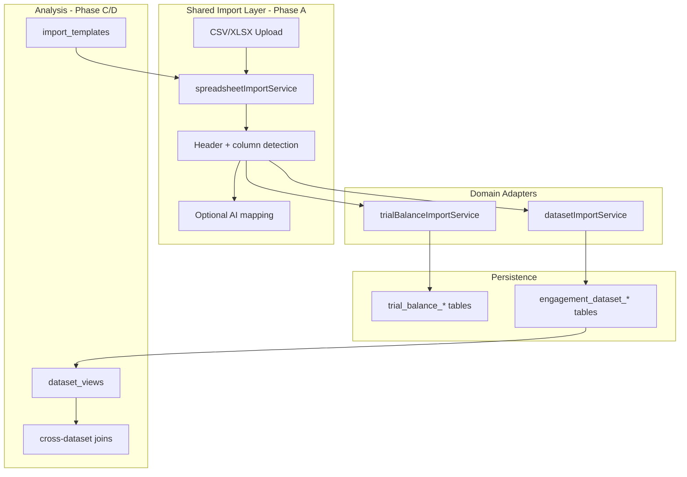

# Engagement Datasets & Custom Analysis

## Purpose

Enable users to import **any** ad-hoc spreadsheet into an engagement, map columns interactively, persist data with full provenance, and build **saved analysis views** — without breaking the existing trial balance workflow.

## Design principles

1. **Additive only** — trial balance import, lead sheets, and execution flows remain unchanged.
2. **Shared import engine** — one spreadsheet parser/detector used by TB and datasets.
3. **Never trap users** — every import shows raw file content; header row and column mapping are always correctable in UI.
4. **Full stack** — UI → API → service → repository → PostgreSQL, with workspace scoping and RBAC.
5. **Governed provenance** — every import batch records file name, mapping, actor, warnings (per financial governance docs).

## Architecture



## Phases

| Phase | Scope | Breaking change risk |
|-------|--------|----------------------|
| **A** | Extract `spreadsheetImportService`; TB re-exports | None — re-export compatibility |
| **B** | `engagement_datasets` + import API + UI | None — new tables/routes only |
| **C** | Saved analysis views (filter/group/calculate) | None — new feature on datasets |
| **D** | Workspace import templates + cross-dataset joins | None — optional enhancements |

## Phase documents

- [Phase A — Shared import engine](./phase-a-shared-import-engine.md)
- [Phase B — Engagement datasets](./phase-b-engagement-datasets.md)
- [Phase C — Analysis views](./phase-c-analysis-views.md)
- [Phase D — Templates & cross-dataset joins](./phase-d-templates-and-joins.md)

## API namespace (additive)

```
GET    /v1/accounting/engagements/:id/datasets
POST   /v1/accounting/engagements/:id/datasets
GET    /v1/accounting/engagements/:id/datasets/:datasetId
PATCH  /v1/accounting/engagements/:id/datasets/:datasetId
DELETE /v1/accounting/engagements/:id/datasets/:datasetId
POST   /v1/accounting/engagements/:id/datasets/preview
POST   /v1/accounting/engagements/:id/datasets/:datasetId/import
GET    /v1/accounting/engagements/:id/datasets/:datasetId/rows

Phase C:
GET/POST/PATCH/DELETE .../datasets/:datasetId/views
POST   .../datasets/:datasetId/views/:viewId/execute

Phase D:
GET/POST workspace dataset import templates
```

## Permissions

| Action | Permission |
|--------|------------|
| List/read datasets & views | `working_papers.read` |
| Create/import/edit/delete | `working_papers.manage` |

## Regression checklist

- [ ] Trial balance preview/import unchanged
- [ ] Trial balance smart-import tests pass
- [ ] Lead sheet generation still works
- [ ] Engagement execution bundle unaffected
- [ ] Workspace tenant isolation on all dataset queries

## Implementation order

1. Phase A — refactor + test parity
2. Phase B — schema → repository → service → API → frontend
3. Phase C — views on top of dataset rows
4. Phase D — templates and joins
